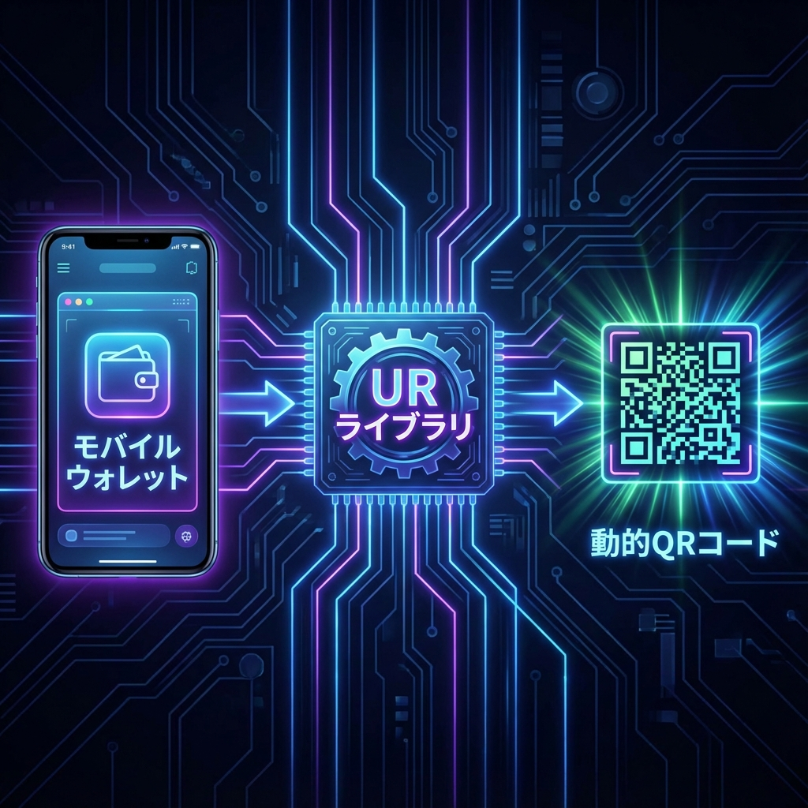
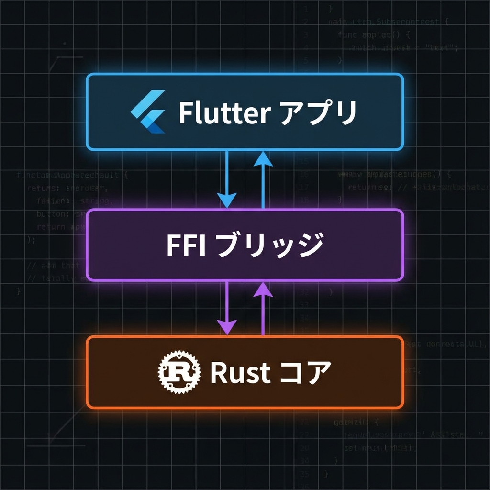
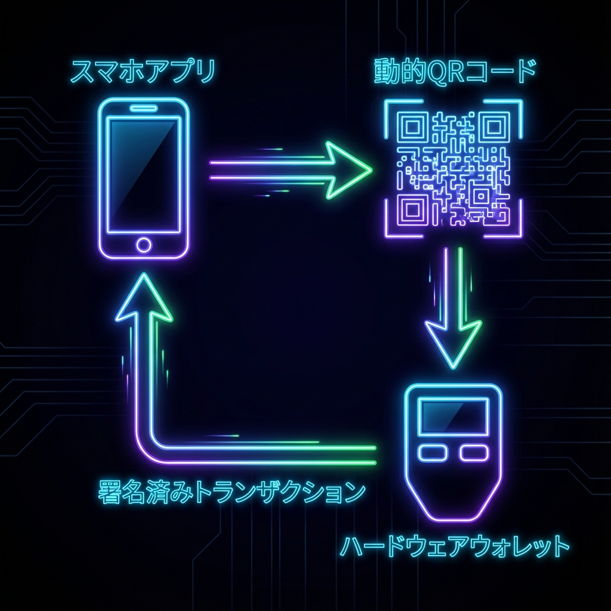

# UR Registry Rust - TRON サポート

[](https://opensource.org/licenses/MIT)
[](https://developer.android.com/studio)
[](https://flutter.dev)

> **これは [KeystoneHQ/ur-registry-rust](https://github.com/KeystoneHQ/ur-registry-rust) のフォークであり、エアギャップ型ハードウェアウォレット向けの TRON ブロックチェーンサポートを追加しています。**

[English](./README.md) | [繁體中文](./README_TW.md) | [日本語](./README_JA.md) | [한국어](./README_KO.md)

---

## 🚀 概要

オリジナルの UR Registry 実装は Bitcoin、Ethereum、Solana、Cardano をサポートしています。このフォークは **TRON エコシステム** に対応し、動的QRコード (BC-UR) を使用してエアギャップ型ハードウェアウォレットで安全にスケーラブルなトランザクション署名を可能にします。

### ✨ 主な機能

*   **TRON 署名リクエスト (Sign Request)**: `tron-sign-request` UR タイプ。トランザクション署名リクエストに使用されます。
*   **TRON 署名 (Signature)**: `tron-signature` UR タイプ。署名済みトランザクションレスポンスに使用されます。
*   **クロスプラットフォーム**: 完全な Flutter/Dart バインディングと Rust FFI ブリッジ。
*   **プリコンパイル済みライブラリ**: すぐに使える Android ライブラリ (`arm64-v8a`, `armeabi-v7a`) を提供。

---

## 🎯 プロジェクトの役割 (仕組み)

もしあなたが暗号資産ウォレットを開発しているなら、このライブラリは **アプリロジック** と **ユーザーインターフェース (UI)** の間に位置します。生のトランザクションデータをハードウェアウォレットが理解できる標準的な「動的QRコード」形式 (UR) に変換する役割を果たします。



1.  **モバイルウォレット (アプリ)**: ユーザーがトランザクションを開始するアプリ。
2.  **UR ライブラリ (本プロジェクト)**: データを複雑なエンコード (CBOR/Protobuf) を経て標準 BC-UR 形式に変換する「ギア」。
3.  **動的QRコード**: ハードウェアウォレットがスキャンするための最終的な視覚出力。

---

## 🏗 アーキテクチャ

このプロジェクトは、堅牢な FFI レイヤーを使用し、高レベルのモバイルアプリケーション (Flutter) と低レベルの暗号操作 (Rust) の橋渡しをします。



1.  **Flutter アプリ**: UI とユーザーインタラクションを処理。
2.  **FFI ブリッジ**: Dart と Rust 間でデータをやり取り。
3.  **Rust コア**: 高速な CBOR エンコード/デコードと暗号計算を実行。

---

## 🔄 署名フロー

安全な署名プロセスは、ホットウォレット (ソフトウェア) とコールドウォレット (ハードウェア) 間のデータ交換サイクルで構成されます。



1.  **アプリ**: 未署名の TRON トランザクションを作成。
2.  **アプリ**: トランザクションを `tron-sign-request` UR にエンコードし、QRコードとして表示。
3.  **ハードウェアウォレット**: QRコードをスキャンし、リクエストをデコードしてトランザクションに署名。
4.  **ハードウェアウォレット**: 署名を `tron-signature` UR にエンコードし、QRコードとして表示。
5.  **アプリ**: レスポンスをスキャンし、署名を抽出してトランザクションをブロードキャスト。

---

## 📦 使用方法

### 1. 署名リクエストの作成 (Flutter)

ハードウェアウォレットに送信するリクエストを作成します。

```dart
import 'package:ur_registry_flutter/registries/tron/tron_sign_request.dart';

// リクエストの作成
final request = TronSignRequest.factory(
  signData: unsignedTxBytes,       // 生のトランザクションバイト列
  path: "m/44'/195'/0'/0/0",       // 導出パス
  xfp: "12345678",                 // マスターフィンガープリント
  address: "TRxxx...",             // TRON アドレス
  origin: "TRON MultiSig Wallet",  // リクエスト元アプリ名
  dataType: TronSignRequest.transaction,
);

// 動的QRコードとして表示するための UR エンコーダーを取得
final urEncoder = request.toUREncoder();
String qrData = urEncoder.nextPart();
```

### 2. 署名の解析

ハードウェアウォレットからのレスポンスを処理します。

```dart
import 'package:ur_registry_flutter/registries/tron/tron_signature.dart';

void onScanSuccess(NativeObject object) {
  if (object is TronSignature) {
    final signature = object.getSignature(); // 署名の Hex 文字列
    final requestId = object.getRequestId(); // リクエストと照合するための UUID
    
    print("受信した署名: $signature");
  }
}
```

---

## 🛠 ビルドとインストール

### 前提条件
*   Android NDK 27.x 以降
*   Rust Nightly ツールチェーン

### セットアップ

1.  **Rust ターゲットのインストール**:
    ```bash
    rustup install nightly
    rustup default nightly
    rustup target add aarch64-linux-android armv7-linux-androideabi
    ```

2.  **Cargo NDK のインストール**:
    ```bash
    cargo install cargo-ndk
    ```

3.  **ライブラリのビルド**:
    ```bash
    export ANDROID_NDK_HOME=/path/to/ndk
    cargo ndk -t arm64-v8a -t armeabi-v7a -o ./jniLibs build --release -p ur-registry-ffi
    ```

---

## 📂 プロジェクト構造

*   `libs/ur-registry-ffi/src/tron/`: TRON 型の Rust 実装。
*   `interface/ur_registry_flutter/lib/registries/tron/`: Dart 言語バインディング。
*   `jniLibs/`: プリコンパイル済み Android `.so` ファイル。

---

## 📜 ライセンス

このプロジェクトは MIT ライセンスの下で公開されています - 詳細は [LICENSE](LICENSE) ファイルをご覧ください。
