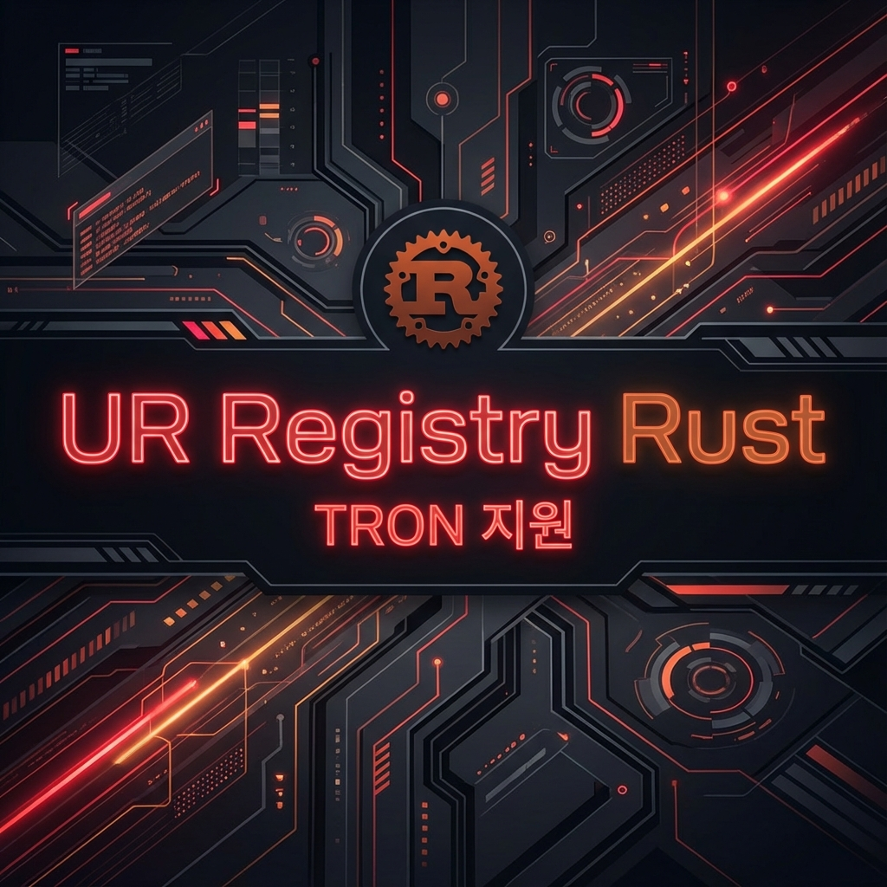
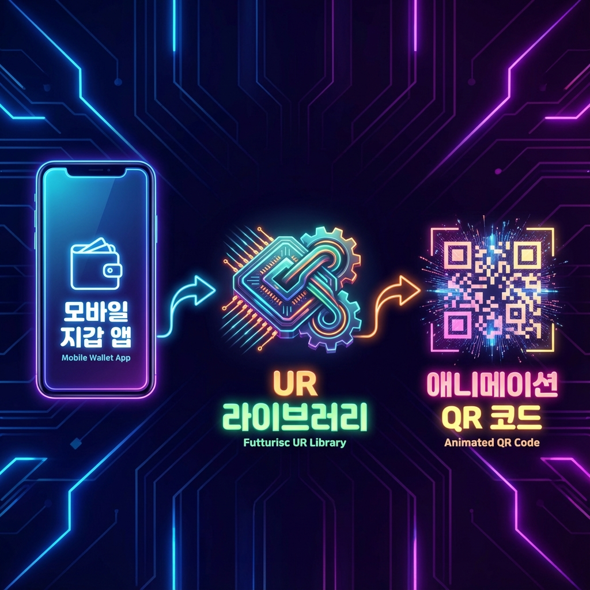
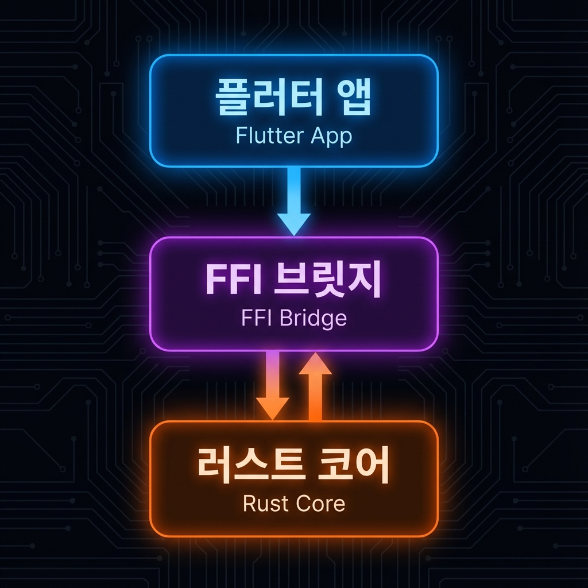
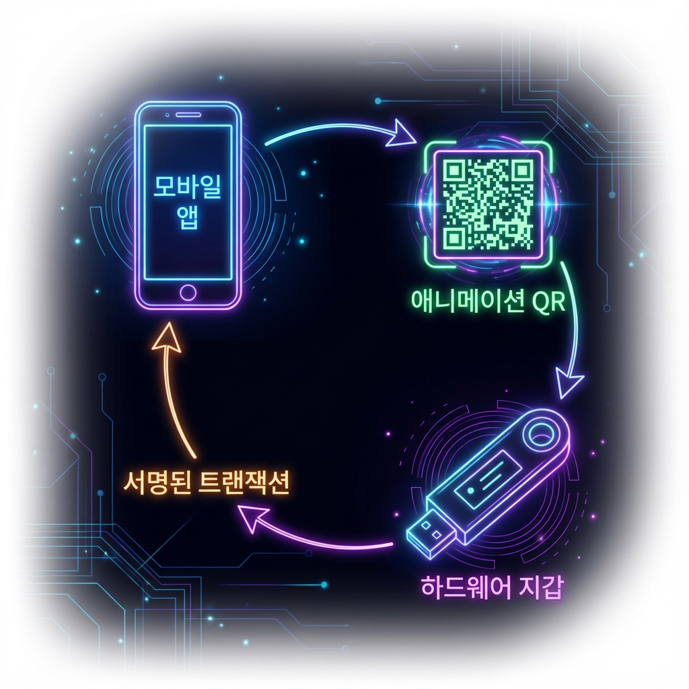

# UR Registry Rust - TRON 지원

[](https://opensource.org/licenses/MIT)
[](https://developer.android.com/studio)
[](https://flutter.dev)

> **이 프로젝트는 [KeystoneHQ/ur-registry-rust](https://github.com/KeystoneHQ/ur-registry-rust) 의 포크 버전이며, 에어갭(Air-gapped) 하드웨어 지갑을 위한 TRON 블록체인 지원을 추가했습니다.**

[English](./README.md) | [繁體中文](./README_TW.md) | [日本語](./README_JA.md) | [한국어](./README_KO.md)

---

## 🚀 개요

기존 UR Registry 구현은 Bitcoin, Ethereum, Solana, Cardano를 지원합니다. 이 포크는 **TRON 생태계** 로 지원을 확장하여, 에어갭 하드웨어 지갑이 동적 QR 코드(BC-UR)를 통해 트랜잭션에 안전하게 서명할 수 있도록 합니다.

### ✨ 주요 기능

*   **TRON 서명 요청 (Sign Request)**: `tron-sign-request` UR 타입, 트랜잭션 서명 요청 생성.
*   **TRON 서명 (Signature)**: `tron-signature` UR 타입, 서명된 트랜잭션 응답 처리.
*   **크로스 플랫폼 지원**: 완전한 Flutter/Dart 바인딩 및 Rust FFI 브릿지.
*   **사전 컴파일된 라이브러리**: 즉시 사용 가능한 Android 라이브러리 (`arm64-v8a`, `armeabi-v7a`) 제공.

---

## 🎯 프로젝트 위치 (작동 방식)

암호화폐 지갑을 개발 중이라면, 이 라이브러리는 **앱 로직(App Logic)** 과 **사용자 인터페이스(UI)** 사이에 위치합니다. 원시 트랜잭션 데이터를 하드웨어 지갑이 이해할 수 있는 표준 "동적 QR 코드" 형식(UR)으로 변환하는 역할을 합니다.



1.  **모바일 지갑 앱**: 사용자가 트랜잭션을 시작하는 애플리케이션.
2.  **UR 라이브러리 (이 프로젝트)**: 데이터를 복잡한 인코딩(CBOR/Protobuf)을 거쳐 표준 BC-UR 형식으로 변환하는 "핵심 부품".
3.  **동적 QR 코드**: 하드웨어 지갑이 스캔할 수 있는 최종 시각적 출력물.

---

## 🏗 아키텍처

이 프로젝트는 견고한 FFI 계층을 통해 고수준 모바일 애플리케이션(Flutter)과 저수준 암호화 연산(Rust)을 연결합니다.



1.  **Flutter 앱**: UI 및 사용자 상호 작용 처리.
2.  **FFI 브릿지**: Dart와 Rust 간의 데이터 전달.
3.  **Rust 코어**: 고성능 CBOR 인코딩/디코딩 및 암호화 연산 수행.

---

## 🔄 서명 흐름

안전한 서명 프로세스는 핫 월렛(소프트웨어)과 콜드 월렛(하드웨어) 간의 데이터 교환 주기로 이루어집니다.



1.  **앱**: 서명되지 않은 TRON 트랜잭션 생성.
2.  **앱**: 트랜잭션을 `tron-sign-request` UR로 인코딩하여 QR 코드로 표시.
3.  **하드웨어 지갑**: QR 코드를 스캔하고 요청을 디코딩하여 트랜잭션에 서명.
4.  **하드웨어 지갑**: 서명을 `tron-signature` UR로 인코딩하여 QR 코드로 표시.
5.  **앱**: 응답을 스캔하고 서명을 추출하여 트랜잭션 브로드캐스트.

---

## 📦 사용 방법

### 1. 서명 요청 생성 (Flutter)

하드웨어 지갑으로 보낼 요청을 생성합니다.

```dart
import 'package:ur_registry_flutter/registries/tron/tron_sign_request.dart';

// 요청 생성
final request = TronSignRequest.factory(
  signData: unsignedTxBytes,       // 원시 트랜잭션 바이트
  path: "m/44'/195'/0'/0/0",       // 파생 경로
  xfp: "12345678",                 // 마스터 지문 (Master Fingerprint)
  address: "TRxxx...",             // TRON 주소
  origin: "TRON MultiSig Wallet",  // 요청 앱 이름
  dataType: TronSignRequest.transaction,
);

// 동적 QR 코드로 표시하기 위한 UR 인코더 가져오기
final urEncoder = request.toUREncoder();
String qrData = urEncoder.nextPart();
```

### 2. 서명 파싱

하드웨어 지갑의 응답을 처리합니다.

```dart
import 'package:ur_registry_flutter/registries/tron/tron_signature.dart';

void onScanSuccess(NativeObject object) {
  if (object is TronSignature) {
    final signature = object.getSignature(); // 서명 Hex 문자열
    final requestId = object.getRequestId(); // 요청과 매칭하기 위한 UUID
    
    print("수신된 서명: $signature");
  }
}
```

---

## 🛠 빌드 및 설치

### 필수 요건
*   Android NDK 27.x 이상
*   Rust Nightly 툴체인

### 설정

1.  **Rust 타겟 설치**:
    ```bash
    rustup install nightly
    rustup default nightly
    rustup target add aarch64-linux-android armv7-linux-androideabi
    ```

2.  **Cargo NDK 설치**:
    ```bash
    cargo install cargo-ndk
    ```

3.  **라이브러리 빌드**:
    ```bash
    export ANDROID_NDK_HOME=/path/to/ndk
    cargo ndk -t arm64-v8a -t armeabi-v7a -o ./jniLibs build --release -p ur-registry-ffi
    ```

---

## 📂 프로젝트 구조

*   `libs/ur-registry-ffi/src/tron/`: TRON 타입 Rust 구현.
*   `interface/ur_registry_flutter/lib/registries/tron/`: Dart 언어 바인딩.
*   `jniLibs/`: 사전 컴파일된 Android `.so` 파일.

---

## 📜 라이선스

이 프로젝트는 MIT 라이선스에 따라 배포됩니다. 자세한 내용은 [LICENSE](LICENSE) 파일을 참조하세요.
