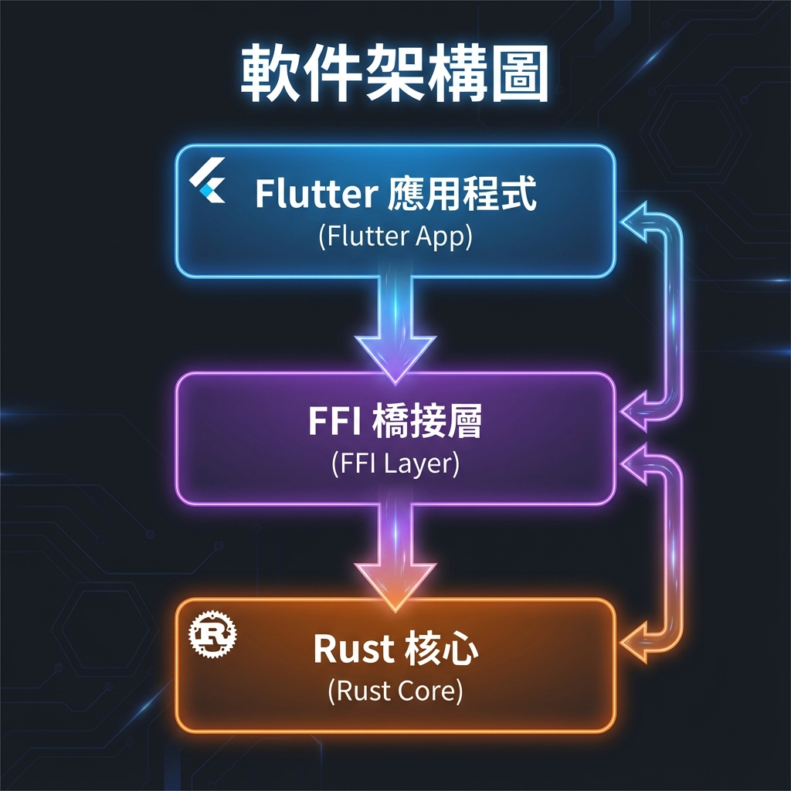
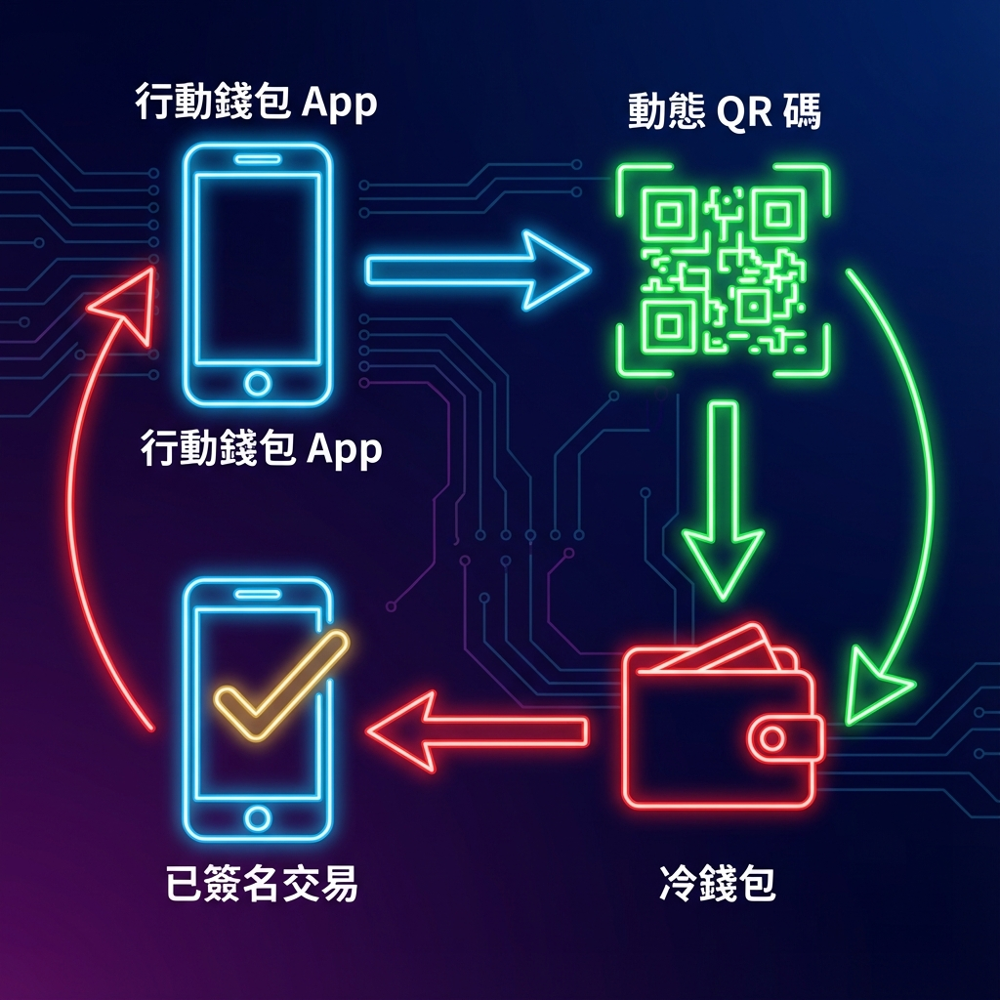

# UR Registry Rust - TRON 支援

[](https://opensource.org/licenses/MIT)
[](https://developer.android.com/studio)
[](https://flutter.dev)

> **這是一個 [KeystoneHQ/ur-registry-rust](https://github.com/KeystoneHQ/ur-registry-rust) 的專門分叉版本，專為支援 TRON 區塊鏈的冷錢包開發。**

[English](./README.md) | [繁體中文](./README_TW.md) | [日本語](./README_JA.md) | [한국어](./README_KO.md)

---

## 🚀 概覽

原始的 UR Registry 實作支援 Bitcoin, Ethereum, Solana, 和 Cardano。此分叉版本將支援擴展到了 **TRON 生態系統**，允許冷錢包（Air-gapped hardware wallets）透過動態 QR 碼 (BC-UR) 安全地簽署交易。

### ✨ 核心功能

*   **TRON 簽名請求 (Sign Request)**: `tron-sign-request` UR 類型，用於發起交易簽名請求。
*   **TRON 簽名 (Signature)**: `tron-signature` UR 類型，用於返回已簽署的交易數據。
*   **跨平台支援**: 完整的 Flutter/Dart 綁定與 Rust FFI 橋接層。
*   **預編譯庫**: 提供開箱即用的 Android 庫文件 (`arm64-v8a`, `armeabi-v7a`)。

---

## 🎯 專案定位 (如何運作)

如果您正在開發一款加密貨幣錢包，此庫位於 **應用程式邏輯 (App Logic)** 與 **使用者介面 (UI)** 之間。它負責將原始交易數據轉換為硬體錢包能理解的標準 "動態 QR 碼" 格式 (UR)。


1.  **行動錢包 App**: 使用者發起交易的應用程式。
2.  **UR 協議庫 (本專案)**: 負責將數據進行複雜編碼 (CBOR/Protobuf) 並轉換為標準 BC-UR 格式的 "核心組件"。
3.  **動態 QR 碼**: 最終顯示給硬體錢包掃描的視覺輸出。

---

## 🏗 軟體架構

本專案透過強健的 FFI 層，橋接了高層級的行動應用程式 (Flutter) 與底層的加密運算 (Rust)。



1.  **Flutter 應用程式**: 處理 UI 顯示與使用者交互。
2.  **FFI 橋接層**: 在 Dart 與 Rust 之間傳遞數據。
3.  **Rust 核心**: 執行高效的 CBOR 編解碼與加密運算。

---

## 🔄 簽名流程

安全的簽名過程涉及熱錢包 (軟體) 與冷錢包 (硬體) 之間的數據交換循環。



1.  **App**: 構建未簽名的 TRON 交易。
2.  **App**: 將交易編碼為 `tron-sign-request` UR 並顯示為 QR 碼。
3.  **冷錢包**: 掃描 QR 碼，解碼請求，並簽署交易。
4.  **冷錢包**: 將簽名編碼為 `tron-signature` UR 並顯示為 QR 碼。
5.  **App**: 掃描回應，提取簽名，並廣播交易。

---

## 📦 使用方法

### 1. 創建簽名請求 (Flutter)

構建一個請求發送給硬體錢包。

```dart
import 'package:ur_registry_flutter/registries/tron/tron_sign_request.dart';

// 創建請求
final request = TronSignRequest.factory(
  signData: unsignedTxBytes,       // 原始交易字節
  path: "m/44'/195'/0'/0/0",       // 衍生路徑
  xfp: "12345678",                 // 主指紋 (Master Fingerprint)
  address: "TRxxx...",             // TRON 地址
  origin: "TRON MultiSig Wallet",  // 發起請求的 App 名稱
  dataType: TronSignRequest.transaction,
);

// 獲取 UR 編碼器以顯示為動態 QR 碼
final urEncoder = request.toUREncoder();
String qrData = urEncoder.nextPart();
```

### 2. 解析簽名

處理來自硬體錢包的回應。

```dart
import 'package:ur_registry_flutter/registries/tron/tron_signature.dart';

void onScanSuccess(NativeObject object) {
  if (object is TronSignature) {
    final signature = object.getSignature(); // 簽名的 Hex 字串
    final requestId = object.getRequestId(); // 用於匹配請求的 UUID
    
    print("收到簽名: $signature");
  }
}
```

---

## 🛠 構建與安裝

### 前置需求
*   Android NDK 27.x 或更高版本
*   Rust Nightly 工具鏈

### 安裝步驟

1.  **安裝 Rust 目標平台**:
    ```bash
    rustup install nightly
    rustup default nightly
    rustup target add aarch64-linux-android armv7-linux-androideabi
    ```

2.  **安裝 Cargo NDK**:
    ```bash
    cargo install cargo-ndk
    ```

3.  **編譯庫文件**:
    ```bash
    export ANDROID_NDK_HOME=/path/to/ndk
    cargo ndk -t arm64-v8a -t armeabi-v7a -o ./jniLibs build --release -p ur-registry-ffi
    ```

---

## 📂 專案結構

*   `libs/ur-registry-ffi/src/tron/`: TRON 類型的 Rust 實作。
*   `interface/ur_registry_flutter/lib/registries/tron/`: Dart 語言綁定。
*   `jniLibs/`: 預編譯的 Android `.so` 文件。

---

## 📜 許可證

本專案採用 MIT 許可證 - 詳情請見 [LICENSE](LICENSE) 文件。
